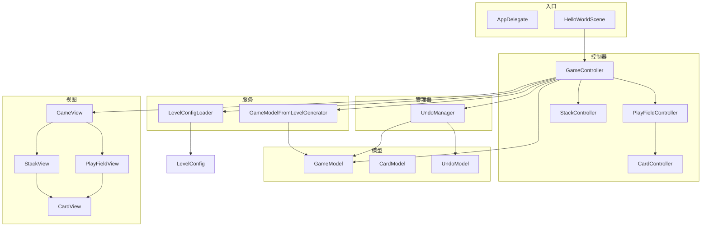

# 程序设计说明：代码结构与扩展指南

本文档面向需要阅读、维护或扩展本项目的开发者，说明当前分层、模块职责，以及**在不破坏现有玩法的前提下**如何新增卡牌表现与新增回退类型。

---

## 1. 总体架构（MVC）

项目采用 **MVC**：静态配置与关卡数据在 **configs**，运行时状态在 **models**，界面在 **views**，用户意图与流程在 **controllers**，带状态的过程性能力在 **managers**，无状态转换与规则放在 **services**，通用小工具放在 **utils**（若目录为空，仅作占位，可逐步迁入）。

| 目录 | 职责（人话） |
|------|----------------|
| `Classes/configs/` | 关卡 JSON、卡牌资源路径等「开局前就知道」的数据，以及加载器 |
| `Classes/models/` | 运行中的游戏状态：`GameModel`、`CardModel`、`UndoModel` |
| `Classes/views/` | 只负责显示与触摸，通过**回调**把点击交给控制器 |
| `Classes/controllers/` | 串联 Model 与 View：是否允许操作、何时记撤销、何时播动画 |
| `Classes/managers/` | 挂在 Controller 上，加工 Model（如 `UndoManager`），**不做单例** |
| `Classes/services/` | 把配置变成模型等无状态逻辑，如 `GameModelFromLevelGenerator` |

**依赖方向（建议牢记）**：View →（回调）→ Controller → Model / Manager；Service 只被 Controller 或初始化路径调用；Service **不依赖** Controller。

---

## 2. 结构一览图

---

## 3. 从关卡到画面：初始化链路

便于你把「数据从哪来、谁创建 View」串起来：

1. `HelloWorldScene` 创建 `GameController`，调用 `initGame(levelId)`。
2. `LevelConfigLoader::loadLevelConfig(levelId)` 读取 `res/level_<id>.json`（失败时用加载器内默认数据）。
3. `GameModelFromLevelGenerator::generateGameModel(LevelConfig)` 生成 `GameModel`：按配置创建每张 `CardModel`，分配 id，并从备用牌堆抽出初始底牌等。
4. `GameView` 创建子视图 `PlayFieldView`、`StackView`；`PlayFieldController` / `StackController` 根据 `GameModel` 创建 `CardView` 并注册点击回调到 `GameController` 的 `handleCardClick`、`handleStackClick`、`handleHandCardClick` 等。

---

## 4. 一次点击如何走完（概念流程）

以「主牌区可匹配的牌被点击」为例：

1. **View**：`CardView` 触摸 → 执行注册的点击回调（由 Controller 事先设置）。
2. **Controller**：`GameController::handleCardClick` 校验是否动画中、是否可匹配；通过 `UndoManager` **写入一条撤销记录**；再驱动 `CardView` 移动动画，动画结束回调里更新 `GameModel`（如底牌替换、桌面牌状态），并刷新 `StackView` 等。

撤销的**数据回滚**与**带动画的回退**当前分工如下：

- `UndoManager` 内部仍保留 `undo()`，可对模型做「无动画」式恢复；实际游戏流程里，**带界面动画的回退**主要在 `GameController::handleUndo` 中根据 `OperationRecord` 分类型处理。
- 新增回退类型时，两处逻辑都要能描述「记了什么」与「如何复原」，见下文第 6 节。

---

## 5. 如何新增一张「卡牌」（扩展指南）

这里的「卡牌」指：**关卡里多一张牌**，并在界面上正确显示、参与现有规则。按层次拆：

### 5.1 数据含义（牌面 / 花色）

- 枚举定义在 `Classes/models/CardModel.h`：`CardFaceType`、`CardSuitType`，与需求文档中的取值一致。
- 若增加**新的牌面或花色枚举值**，需要保证 `LevelConfig` / JSON 里的整数与枚举一致，且下面各层有对应资源或映射。

### 5.2 关卡与静态配置

- 在 `res/level_N.json` 的 `Playfield` 或 `Stack` 数组中增加一项，填写 `CardFace`、`CardSuit`、`Position`（格式见项目根目录 `readme.md`）。
- 无需改 C++ 即可让 `LevelConfigLoader` 读入；若改字段名或结构，需同步修改 `LevelConfigLoader::loadFromJson`。

### 5.3 从配置到运行时模型

- `GameModelFromLevelGenerator::createCardModel` 使用 `CardConfig` 构造 `CardModel`。若 `CardModel` 增加新字段（例如特殊标记），应在此统一赋值。

### 5.4 资源与显示（View）

- 数字图：`CardView.cpp` 中 `faceToken`、`numberSpritePath` 等根据 `face` / `suit` 拼 `res/number/...` 路径；新牌面需有对应图片或扩展分支。
- 花色图：`CardResConfig` 提供 `getSuitPath`；新花色需在 `CardResConfig` 实现里增加映射，并在 `res/` 放置素材。
- 若整张牌外观规则变化很大，可再封装一层，但应保持 **View 不写业务规则**，只根据 `CardModel` 选图。

### 5.5 规则与操作（可选）

- 匹配规则在 `GameModel::canMatchCard` 等；若新卡牌类型有**不同匹配规则**，更干净的做法是抽成 small service 或由 Controller 先分支再调 Model，避免在 View 里判断。

**小结**：只加「普通扑克牌」且资源已齐 → 通常只改 **JSON + 资源文件**；加**新类型牌** → 还要改 **`CardModel` / 生成器 / `CardView` 与 `CardResConfig` / 规则函数**。

---

## 6. 如何新增一种「回退」类型（扩展指南）

回退由三部分协作：**记什么（数据结构）**、**何时记（业务点）**、**如何撤销（模型 + 界面）**。

### 6.1 数据层：`UndoModel` / `OperationRecord`

- 文件：`Classes/models/UndoModel.h`（及对应 `.cpp`）。
- 在枚举 `OperationType` 中增加新枚举值，例如 `OP_YOUR_ACTION`。
- 若新操作需要额外字段（第二张牌、自定义索引等），在 `OperationRecord` 中增加成员，并**初始化默认值**，避免未赋值导致回退错乱。

在 `UndoModel` 中为该类型增加「入栈」方法（与现有 `addMatchCardRecord` 等并列），内部设置 `record.type` 并 `push` 到 `_operationStack`。

### 6.2 管理器：`UndoManager`

- 增加 `recordYourAction(...)`，内部调用 `UndoModel` 的新方法。
- **若**仍使用 `UndoManager::undo()` 做纯模型回退：在 `switch (record->type)` 中增加 `case OP_YOUR_ACTION:`，写出与「执行该操作」相反的 `GameModel` 修改，与现有三种类型风格保持一致。

### 6.3 控制器：`GameController`

- 在**执行该新操作之前**（与现有 `recordMatchCard` 等相同时机）调用 `UndoManager::recordYourAction(...)`，传入撤销所需快照（底牌指针、移动牌指针、世界坐标等）。
- 在 `handleUndo` 中根据 `record.type` 增加分支：通常包括 **先恢复 `GameModel`**，再 **移动/替换 `CardView`**（与现有 `OP_MATCH_CARD`、`OP_DRAW_STACK`、`OP_SWAP_HAND` 的模式一致）。

### 6.4 注意点（避免坏档或动画错位）

- 动画回退依赖 `fromWorldPos` 等字段时，记录阶段务必传入**与当前实现一致**的世界坐标。
- 新类型若涉及牌在 `PlayFieldView` 与 `StackView` 之间迁移，参考现有 case 里 `retain`/`release`、`setTrayCard`、`refreshHandCards` 的顺序，避免双重释放或野指针。

---

## 7. 与 `readme.md` 的对应关系

- 分辨率、关卡 JSON 格式、分层目录名以根目录 **`readme.md`** 为准。
- 本文侧重 **「人读得懂的架构说明」** 与 **「扩展步骤」**；编码细则（命名、注释、行数等）仍以 `readme.md` 第四节为准。

---

## 8. 文档维护

当发生以下变更时，建议同步更新本文档：

- 增加/删除主要 Controller 或 Manager。
- 修改 `OperationType` 或撤销流程（例如从「仅模型回退」改为「全部动画回退」）。
- 关卡或卡牌数据格式变更。
